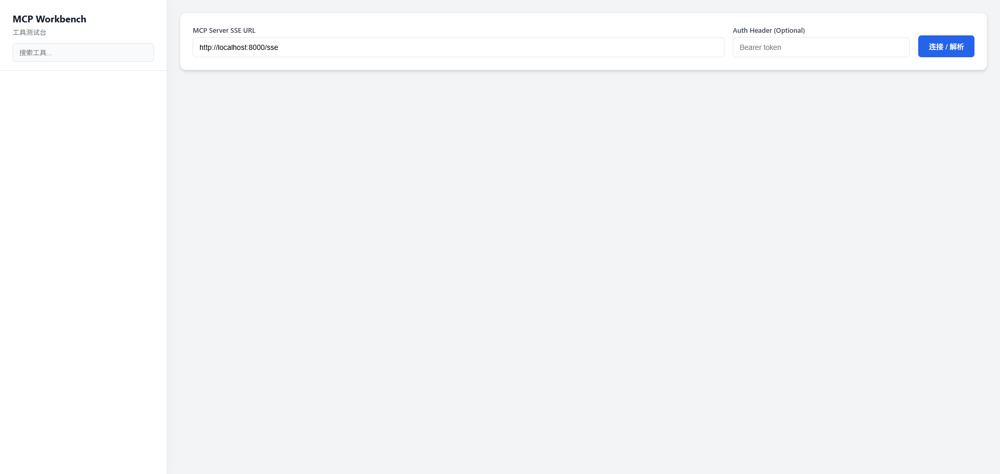
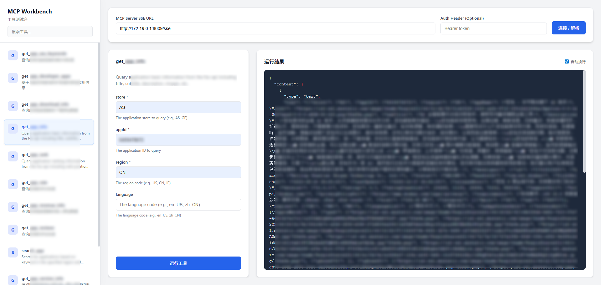

# MCP 工具测试台 (MCP Tools Workbench)

这是一个独立的 MCP (Model Context Protocol) 工具测试台，旨在为开发者提供一个便捷的环境来连接、调试和测试 MCP Server，支持 SSE (Server-Sent Events) 协议的 MCP Server 连接。

## ✨ 核心功能

- **🔌 连接 MCP Server**: 支持输入 MCP Server 的 SSE 地址进行连接。
- **🔐 鉴权支持**: 支持配置自定义请求头（Header），如 `Authorization` 等鉴权信息。
- **🛠️ 工具管理**: 
    - 自动解析并展示 Server 提供的所有可用工具。
    - **🔍 实时搜索**: 支持通过名称或描述快速筛选工具。
- **🧪 在线测试**:
    - 根据工具 Schema 自动生成测试表单。
    - 支持参数输入和必填项校验。
    - **👀 结果查看**: 实时展示运行结果，支持**自动换行**切换，方便查看长文本。

## � 界面预览




##  🚀 快速开始

 **访问应用**
    打开浏览器访问：[http://localhost:3001](http://localhost:3001)

### 🐳 Docker 部署

本项目支持 Docker 容器化部署。

1.  **构建并启动**
    在 `mcp-tools` 目录下运行：
    ```bash
    docker-compose up -d --build
    ```
    *注意：Docker 构建上下文设置为项目根目录，以便访问共享依赖包。*

2.  **访问应用**
    启动成功后，访问：[http://localhost:3001](http://localhost:3001)

## 📖 使用说明

1.  **配置连接**:
    - 在页面顶部的输入框中填写 MCP Server 的完整地址（例如：`http://localhost:8000/sse`）。
    - 如果 Server 需要鉴权，可在 Header 输入框中填写（如 `Bearer token`）。

2.  **查找工具**:
    - 点击“连接 / 解析”按钮获取工具列表。
    - 使用左侧的**搜索框**快速查找目标工具。

3.  **测试工具**:
    - 点击左侧列表中的任意工具。
    - 在中间的“参数配置”区域填写参数。
    - 点击“运行工具”按钮。
    - 右侧“运行结果”区域将显示输出。勾选**自动换行**可优化长文本显示。

